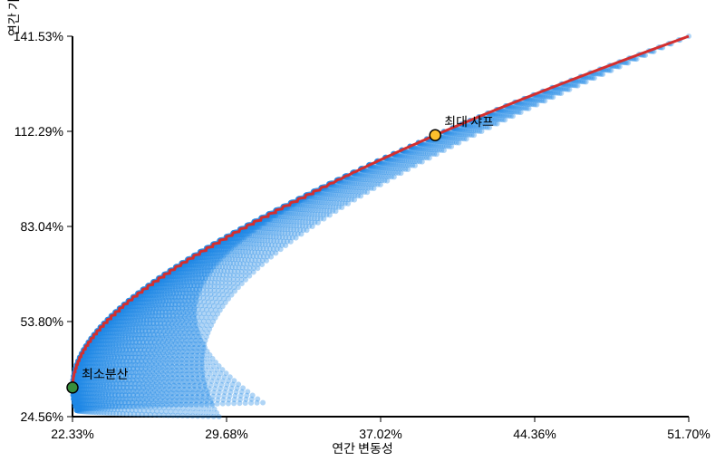

# temp.csv 분석 보고서

## 데이터 개요
- 일자별 삼성전자(005930.KS), 애플(AAPL), 엔비디아(NVDA) 주가 및 거래량을 포함한 CSV 파일입니다.
- 각 날짜마다 종가(Close), 고가(High), 저가(Low), 시가(Open), 거래량(Volume)이 티커별로 반복되는 형태로 배치돼 있습니다.
- 데이터는 2023-10-16부터 2025-10-10까지의 거래일을 다루며, AAPL과 NVDA는 499일, 005930.KS는 482일의 기록이 있습니다.

## 주요 요약 지표
| 티커 | 평균 종가 | 평균 고가 | 평균 저가 | 평균 시가 | 평균 거래량 | 종가 최저 (일자) | 종가 최고 (일자) | 거래량 최소 (일자) | 거래량 최대 (일자) | 기간 동안 종가 변화 |
| --- | ---: | ---: | ---: | ---: | ---: | --- | --- | --- | --- | --- |
| 005930.KS | 66,471.53 | 67,202.08 | 65,822.65 | 66,509.00 | 19,481,205 | 48,968.97 (2024-11-14) | 94,400.00 (2025-10-10) | 2,957,915 (2024-01-15) | 57,691,266 (2024-01-11) | +45.72% (64,781.67 → 94,400.00) |
| AAPL | 209.52 | 211.47 | 207.33 | 209.29 | 56,558,297 | 163.82 (2024-04-19) | 258.10 (2024-12-26) | 23,234,700 (2024-12-24) | 318,679,900 (2024-09-20) | +38.58% (176.99 → 245.27) |
| NVDA | 115.60 | 117.54 | 113.41 | 115.59 | 325,122,505 | 40.30 (2023-10-26) | 192.57 (2025-10-09) | 105,157,000 (2024-12-24) | 1,142,269,000 (2024-03-08) | +297.59% (46.07 → 183.16) |

> **참고:** 삼성전자 종목은 일부 거래일 데이터가 비어 있어 집계 건수가 다른 티커보다 적습니다.

## 추세 관찰
- 세 종목 모두 기간 전반에 걸쳐 종가가 상승했으며, 특히 엔비디아는 약 298%의 상승률로 가장 큰 성장세를 보였습니다.
- 2024년 하반기에는 세 종목 모두 거래량 변동성이 커졌으며, 애플과 엔비디아의 거래량 저점은 2024-12-24로 동일합니다.
- 삼성전자의 거래량은 2024년 1월 초반에 크게 증가했고(1월 11일 최대치), 바로 다음 거래일에 저점을 기록해 단기 급등락이 있었습니다.

## 재현 방법
1. Python 내장 `csv` 모듈을 사용해 데이터를 읽어옵니다.
2. 티커와 지표별 열 위치를 매핑합니다.
3. 날짜별 값 목록을 만든 뒤 평균, 최솟값, 최댓값 및 첫/마지막 종가를 계산합니다.

```python
import csv
from statistics import mean

with open("temp.csv") as f:
    rows = list(csv.reader(f))

metrics = ["Close", "High", "Low", "Open", "Volume"]
tickers = ["005930.KS", "AAPL", "NVDA"]
index_map = {}
col = 1
for metric in metrics:
    for ticker in tickers:
        index_map[(ticker, metric)] = col
        col += 1

data = [row for row in rows[3:] if row and row[0]]
series = {
    (ticker, metric): [float(row[index_map[(ticker, metric)]]) for row in data if row[index_map[(ticker, metric)]]]
    for ticker in tickers
    for metric in metrics
}
avg_close = {ticker: mean(series[(ticker, "Close")]) for ticker in tickers}
print(avg_close)
```

위 코드를 확장해 본 보고서의 통계치를 재현할 수 있습니다.

## 효율적 투자선(Efficient Frontier) 분석
- `efficient_frontier_analysis.py` 스크립트를 통해 세 종목의 일간 수익률을 산출한 뒤 연간 기대수익률과 공분산을 계산했습니다.
- 1% 간격으로 전량 투자 조합을 탐색해 효율적 투자선과 최소분산·최대 샤프 포트폴리오를 도출했습니다.

| 구분 | 005930.KS | AAPL | NVDA | 연간 기대수익률 | 연간 변동성 | 샤프비율* |
| --- | ---: | ---: | ---: | ---: | ---: | ---: |
| 자산별 기대수익률 | 28.86% | 24.56% | 141.53% | - | - | - |
| 최소분산 포트폴리오 | 45% | 49% | 6% | 33.51% | 22.33% | 1.50 |
| 최대 샤프 포트폴리오 | 27% | 0% | 73% | 111.11% | 39.62% | 2.80 |

> \* 무위험수익률을 0%로 가정했습니다.

아래 그림은 모든 조합의 위험-수익 좌표와 효율적 투자선, 주요 포트폴리오를 시각화한 결과입니다.


